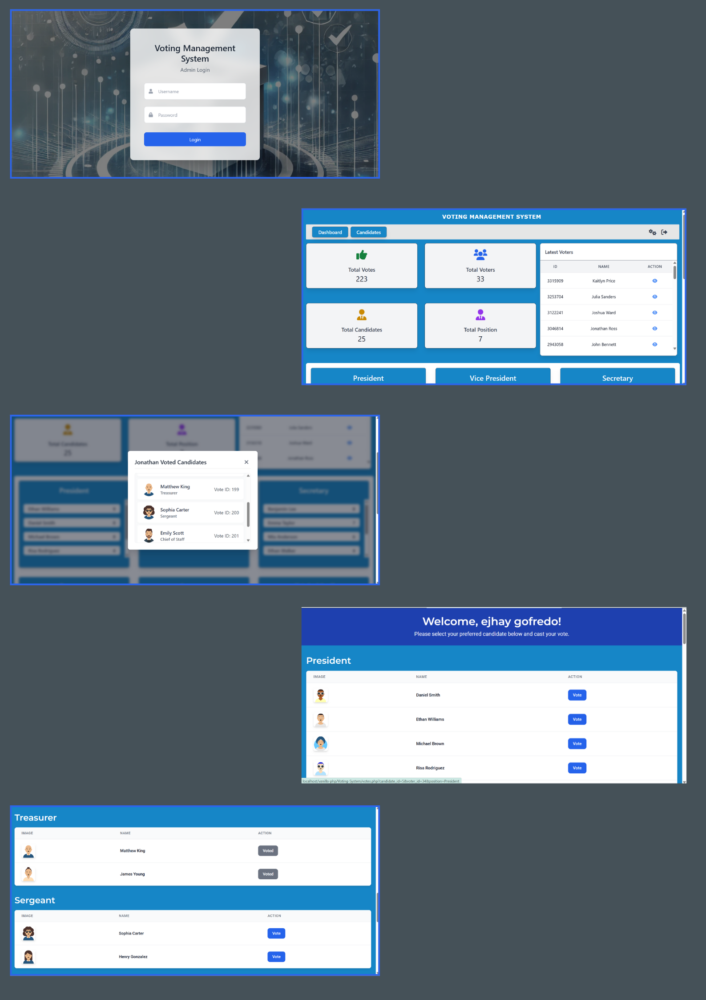

# Voting Management System - A Dynamic Voting System Website

## Overview 📌
The Voting Management System is designed to simplify and streamline the election process. It allows administrators to manage candidates, voting positions, and monitor election results efficiently. Admin features include tracking total votes, voters, candidates, and positions, along with managing candidates and positions through CRUD operations. The platform also provides voters with an easy registration process and a voting page where they can select candidates for various positions. Built with PHP for the backend, MySQL for database management, and a responsive frontend using HTML, CSS, and Tailwind, this system ensures an organized and transparent election experience.



## Features 📌
 - **Admin**
  - **Dashboard**
    - **Total Positions**: The total number of available positions that voters can choose candidates for.
    - **Total Votes**: The overall number of votes cast in the system.
    - **Total Voters**: The total number of registered voters who are eligible to vote.
    - **Total Candidates**: The total number of candidates running for various positions.
    - **Latest Voters**: A list of the most recent voters, with an "eye" button to view the candidates they selected.
    - **List of Candidates**: Sorted by votes, showing candidates from highest to lowest vote count.
  - **Candidates**
    - **Create, Read, Update, Delete (CRUD)** candidate listings.
  - **Positions**
    - **Create, Read, Update, Delete (CRUD)** position listings.
 - **Login/Logout**
 - **End User**
  - **Register**: Voter registration page to allow users to register as eligible voters.
  - **Voting Page**: Registered voters can select their candidates for each available position.

## System Flow 📌
 - **Admin Flow**
  1. **Login**: The admin logs into the system using the secure login page.
  2. **Dashboard Access**: Once logged in, the admin is directed to the dashboard where they can view the total positions, votes, voters, candidates, and the list of latest voters.
  3. **Manage Candidates**: The admin can add, update, or delete candidates through CRUD operations in the **Candidates** section.
  4. **Manage Positions**: The admin can add, update, or delete positions through CRUD operations in the **Positions** section.
  5. **Monitor Votes**: The admin can monitor total votes and view candidates sorted by votes in the **Dashboard** section.
  6. **Logout**: The admin can log out once their tasks are completed.

 - **End User Flow**
  1. **Register**: The voter registers on the registration page to become an eligible voter.
  2. **Login**: After successful registration, the voter redirect into the voting system.
  3. **Voting Page**: voting page where they can see available positions and candidates.
  4. **Select Candidates**: The voter selects their preferred candidates for each position.
  5. **Submit Vote**: After selecting candidates, the voter submits their vote. The system records their vote.
  6. **Finish btn**: The voter can log out after voting.

## Tech Stack 📌
 - **Frontend**: HTML, CSS, Tailwind
 - **Backend**: PHP
 - **Database**: MySQL

1. Clone the repository:
git clone https://github.com/Ejxzdevs/Voting-System.git
cd Voting-System

2. Start your web server :
 - Laragon: Open the system and access the project at http://votingsystem.test (or http://localhost/Voting-System).
 - XAMPP: Move the folder to the htdocs directory, then access it at http://localhost/Voting-System.

3. Database setup:
 - Create a database named "voting_system" in your MySQL server.
 - Import the database from the "voting_system.sql" file located at the root directory of the project.

4. Go to the config folder (located at /config/connection.php) and Update the connection details to match your local environment:
  ```php
  <?php
  $servername = "localhost";
  $username = "root";
  $password = "";
  $database = "voting_system";
  ?>